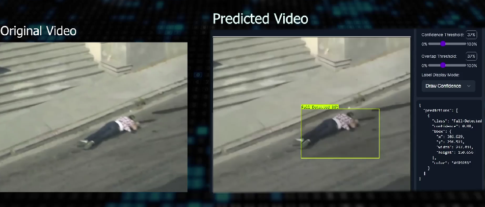

# Fallen Person Detection (Video Processing)

The Fallen Person Detection project aims to develop an automated system that can detect when a person has fallen and alert relevant parties for timely assistance. Falls can be particularly dangerous, especially for vulnerable individuals such as the elderly or those with medical conditions. This project utilizes computer vision and machine learning techniques to analyze video feeds or image data in real-time and identify instances of a person falling.

The system utilizes advanced algorithms and deep learning models to detect human poses and movements. It can accurately distinguish between normal activities and falls, minimizing false alarms.

## Table of Contents

- [Installation](#installation)
- [Contributing](#contributing)
- [Feedback and Suggestions](#feedback-and-suggestions)
## Installation

 1. Clone the repository
 2. Install the required libraries
 3. Import your local image or url 

## Contributing

Contributions are welcome! If you'd like to contribute to this project, please follow these steps:

 1. Fork the repository
 2. Create a new branch
 3. Push to the branch

## Feedback and Suggestions

If you have any feedback or suggestions for improving this model, please feel free to reach out to me. You can contact me via email at s.h.rehaman.art@gmail.com or through WhatsApp [Just Say Hello 👋 ](https://api.whatsapp.com/send/?phone=919777795786&text=Hello%20Shaikh%20Habibur%20Rehaman,%20I%20get%20this%20no.%20from%20your%20Github%20&type=phone_number&app_absent=0)
